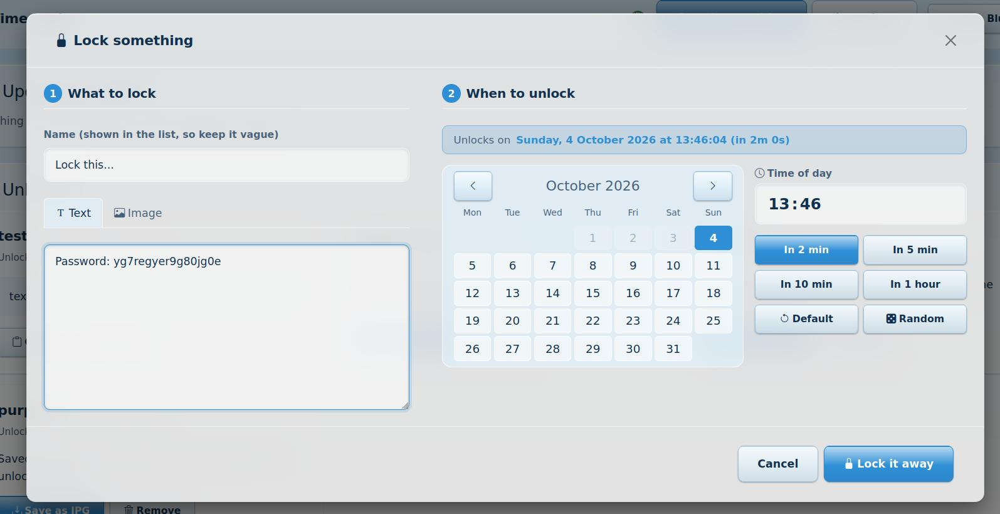

<p align="center">
  <a href="assets/img/time_lock.jpg">
    
  </a>
</p>

<h1 align="center">Time Lock</h1>

<p align="center">
  <strong>Encrypt today. Unlock tomorrow.</strong><br>
  A small, private, local app that locks text and pictures away until a date and time you choose, and then genuinely will not give them back early.
</p>

---

## What it is

Time Lock stores a piece of text (a password, a note, a message to your future self) or a
picture inside an encrypted SQLite database on your own computer. Each item carries an
unlock date. Until that moment arrives, the app refuses to decrypt it: not from the
interface, not from the API, not by editing the database, and not by winding the clock
forward or back.

There is no account, no cloud, no tracking and no server on the internet. The whole
project is a folder you can zip onto a USB stick. It runs as a tiny web app that listens
on your own computer only (`127.0.0.1`) and is opened in your normal browser.

```
Mypassword   ->   can only be decrypted after 17 October 2026
```

## Why it exists

Some things are easier to leave alone when you cannot get at them. Time Lock is a
deliberate speed bump between a moment of weakness and a decision you would make on a
calmer day.

People may find it useful for:

- **Breaking a habit.** Lock away the thing that tempts you (a saved link, a login, a
  photo, a message you keep re-reading) for a day, a week or a month.
- **Routine and discipline.** Lock a reward until a goal date, or lock a letter to open at
  the end of a challenge.
- **Cooling off.** Write the angry message, lock it, and read it again in three days.
- **Gifts to your future self.** Passwords, resolutions, memories, time capsules.
- **Surprise.** Let fate decide with the **Random** option: nobody, including you, will
  know when the item opens.

> **A caring note.** Time Lock is a self-control tool, not a treatment. If you are
> struggling with an addiction or with your wellbeing, please also reach out to a
> professional or a support service where you live. And please do not lock anything you
> might urgently need, such as medical information, emergency contacts or the only copy of
> something important. **Once locked, nothing can bring it back early.**

## Your responsibility (please read this)

**You are solely responsible for everything you lock.**

- The developers have **no way** of decrypting anything you lock. There is no backdoor, no
  master key, no recovery service, no copy of your key and no account to appeal to. Nothing
  is ever sent to anyone.
- If you lose `db/vault.key`, delete the database, lock the wrong thing, or choose a date
  far in the future that you later regret, **the data is gone and nobody can bring it back**,
  including us.
- Do not lock the only copy of anything you might need, such as passwords to essential
  accounts, medical information, legal documents, emergency contacts or irreplaceable photos.
  Keep a separate copy elsewhere.
- Use Time Lock lawfully and kindly. Do not use it to hide anything that is illegal or that
  could harm others. What you store is your decision and your responsibility alone.
- The software is provided as it is, with no warranty of any kind. It is a self-control aid
  and not a security product, a medical device or a substitute for professional help (see the
  limitations below).

If any of that makes you hesitate, start with something small and low stakes, such as a
test note locked for two minutes, so you can see exactly how it behaves.

## Features

**Locking**
- Lock **text** or **images** (jpg, png, webp, gif and bmp are accepted; images are stored as jpg).
- A large month **calendar** and a **time of day** box, with quick buttons: In 2 min, In 5 min, In 10 min, In 1 hour, Default.
- **Random**: unlock at a moment picked in secret, anywhere between one minute and your *Maximum Random Days* setting. The chosen moment is never shown or logged.
- Default lock length is one week. Locking for more than 30 days asks for a second confirmation.
- **Lock longer**: add more time to a locked item. Time can only be added, never taken away.

**Hiding and discipline**
- The unlock date is **concealed by default**. A **Reveal Now** button shows it, at the price of an extra **48 hours**.
- Locked items cannot be edited or deleted. Only unlocked items can be removed.
- A soft **ding** plays when something unlocks while the page is open.

**Extras for the brave**
- **Dare me**: a small button in the Lock window that picks a random challenge ("Lock your most embarrassing note for a month") and sets the time for you.
- **Blind mode** (Settings): names are encrypted too. The list shows "Hidden item 1, 2, 3" and each name appears only when that item unlocks.
- **Decoy locks** (Settings): fake locked items that look exactly like real ones. Nobody, not even you, can tell them apart until they open, and they hold nothing.
- **Panic seal**: re-lock everything that is currently unlocked, for a period you choose. Unlocked picture files are removed from the `unlocked/` folder (the pictures stay safe in the database).

**Images**
- Pick a picture with the built-in folder browser (Home, Pictures, Downloads, Desktop, Documents, removable drives, and **This folder**, where Time Lock was started).
- **Delete the original after locking** (ticked by default). The original is removed only after the stored copy has been read back and checked. A picture uploaded through the browser cannot be deleted for you, because browsers keep file locations private.
- Unlocked images are written to the `unlocked/` folder as jpg files automatically, and can be saved again with one click.

**Time you can trust**
- **Internet time** is used when it is reachable.
- A **protected computer clock** takes over offline. It ignores sudden clock changes while the machine is running and cannot be wound backwards (details below).
- Three modes in Settings: *auto* (default), *protected computer clock only*, *internet only*.

**Protections**
- **Rollback protection**: putting an older copy of the database back is detected, and all unlocking then pauses for 48 hours.
- A per-run **request token**, local-only access, and strict security headers.
- A **kind recovery page** if the key file is missing or damaged, which never invents a new key.
- **Settings are stored encrypted** inside the database.

**Everything else**
- Bootstrap interface with tooltips on everything, 10 colour themes, and remembered preferences (your usual unlock choice, tab and folder) kept in your browser.
- Minimal dependencies: Python, SQLite, Flask, Bootstrap (bundled). Pillow is optional.
- Portable: relative paths only, so the folder can live on a USB stick.

<p align="center">
  <a href="assets/img/example.jpg">
    
  </a>
</p>

## Requirements

| Needed | Version | Notes |
| --- | --- | --- |
| Python | 3.10 or newer | Tested on 3.10.12. See [Installing Python](#installing-python) below |
| Flask | 3.0 or newer (below 4) | Installed by `pip install -r requirements.txt` |
| Pillow | 10.0 or newer | Optional. Needed only to lock png, webp, gif or bmp pictures (jpg works without it) |
| A web browser | Any recent one | Time Lock opens in your normal browser |
| Bootstrap 5.3.8 and Bootstrap Icons 1.11.3 | Bundled | Already inside `assets/`, nothing to install |
| Operating system | Linux, Windows or macOS | Developed and tested on Linux. Windows and macOS are untested |

## Quick start

```bash
pip install -r requirements.txt     # Flask, and optionally Pillow
python3 app.py                      # Windows: python app.py  (or double-click run.bat)
```

Your browser opens at <http://127.0.0.1:5239/>. Press **Lock something**, choose what to
lock and when it should open, and press **Lock it away**. To stop Time Lock, close its
window or press `Ctrl+C` in it.

New to Python? The next section walks through it step by step.

## Installing Python

Time Lock runs on **Python**, a free program that lets your computer run apps like this
one. The official download page is **<https://www.python.org/downloads/>**. You need
version **3.10 or newer**.

### Do I already have it?

Open a terminal (on Windows, press the Windows key, type `cmd` and press Enter; on macOS,
open **Terminal**; on Linux, open your terminal app) and type:

```bash
python3 --version        # Linux and macOS
py --version             # Windows (if this does not work, try: python --version)
```

If it shows `Python 3.10` or higher (for example `Python 3.12.4`), you are ready and can
skip to [Get Time Lock running](#get-time-lock-running).

### Windows

1. Go to <https://www.python.org/downloads/windows/> and download the latest
   **Windows installer (64-bit)**.
2. Open the file you downloaded.
3. **Important:** on the first screen, tick the box **"Add python.exe to PATH"** (or "Add
   Python to PATH") *before* you click **Install Now**. This lets your terminal find Python.
4. Wait for it to finish, then close the installer.
5. Open a **new** Command Prompt and check with `py --version`.

More help: <https://docs.python.org/3/using/windows.html>

### macOS

1. Go to <https://www.python.org/downloads/macos/> and download the latest **macOS 64-bit
   universal2 installer**.
2. Open the downloaded `.pkg` file and follow the steps.
3. Open **Terminal** and check with `python3 --version`.

### Linux

Most Linux systems already include Python 3. If yours does not, install it with your
package manager. These commands normally need administrator permission, so ask whoever looks
after your computer if you are not sure:

| Distribution | Command |
| --- | --- |
| Debian, Ubuntu, Mint, Lubuntu | `apt install python3 python3-pip python3-venv` |
| Fedora | `dnf install python3 python3-pip` |
| Arch, Manjaro | `pacman -S python python-pip` |

Then check with `python3 --version`.

### Get Time Lock running

1. **Download Time Lock.** On the project's GitHub page, press the green **Code** button and
   choose **Download ZIP**, then unzip it somewhere you will remember (a USB stick works too).
   If you use Git, `git clone` the repository instead.
2. **Open a terminal inside the Time Lock folder.** On Windows, open the folder in File
   Explorer, click the address bar, type `cmd` and press Enter.
3. *(Recommended)* **Make a private workspace** so Time Lock's parts stay tidy and separate
   from the rest of your computer:

   ```bash
   python3 -m venv .venv                 # Windows: py -m venv .venv
   source .venv/bin/activate             # Windows: .venv\Scripts\activate
   ```

   More about this: <https://docs.python.org/3/library/venv.html>
4. **Install what Time Lock needs:**

   ```bash
   pip install -r requirements.txt       # if "pip" is not found, use: python3 -m pip install -r requirements.txt
   ```
5. **Start it:**

   ```bash
   python3 app.py                        # Windows: python app.py
   ```

### If something goes wrong

| What you see | What to try |
| --- | --- |
| `python is not recognised` (Windows) | Use `py` instead of `python`, or run the installer again and tick **Add python.exe to PATH** |
| `pip: command not found` | Use `python3 -m pip install -r requirements.txt` |
| `No module named flask` | Run `pip install -r requirements.txt` again, inside the same terminal and workspace |
| `Address already in use` | Another program is using port 5239. Start with `python3 app.py --port 5240` |
| The browser did not open | Type `http://127.0.0.1:5239/` into your browser's address bar yourself |
| Python is too old | Install a newer Python from <https://www.python.org/downloads/> |

### Command line options

| Option | What it does |
| --- | --- |
| `--test-mode` | Adds 10s and 30s presets to the Lock window, handy for trying things out |
| `--seconds-demo` | Seeds two demo items that unlock after 10 and 30 seconds |
| `--offline` | Never contact the internet for the time |
| `--data-dir DIR` | Keep the database, key and unlocked jpgs in `DIR` (safe scratch testing) |
| `--port N` | Use another port (default 5239) |
| `--no-browser` | Do not open the browser automatically |
| `--debug` | Turn `DEBUG_MODE` on for this run (writes `logs/time_lock.log`) |
| `--quiet` | Turn `DEBUG_MODE` off for this run (the default) |
| `--selftest` | Run the automated tests and exit |

### Settings (gear button)

| Setting | Meaning |
| --- | --- |
| Where Time Lock gets the time | Auto, protected computer clock only, or internet only |
| Time website | A secure (https) website used only to read the time. Local or private addresses are refused |
| Default lock length | How far ahead the Lock window starts (minutes). One week is 10080 |
| Maximum Random Days | Upper limit for the Random option. Default 30, maximum 9999. Anything that is not a number is saved as 30 |
| Ding | Sound on or off, and volume |

### Debug mode and the console

`DEBUG_MODE` (in `functions/functions_config.py`, **off by default**) controls audit logging.
When on, meaningful events (locks, unlocks, refusals, large writes, failures) are written
to `logs/time_lock.log`. When off, nothing is written. In both cases the terminal stays
quiet: it shows one start-up line and real errors only. Page polling and static file
requests are never logged. Turn it on for a single run with `python3 app.py --debug`.

## How it works

1. A random 256-bit key is made for each item. The data is encrypted with it and sealed
   with an integrity tag (encrypt-then-MAC). Only the ciphertext is stored.
2. The item key is wrapped using a key derived from a per-install secret (`db/vault.key`)
   **and the unlock timestamp**. Changing the stored date makes the derived key wrong, so
   the item fails its integrity check instead of opening.
3. The unlock date is stored obscured, so a database browser does not show it. Whether the
   *interface* shows it is controlled by the concealed flag.
4. There is no route, in the interface or the API, to read, change or delete a locked item.
5. The crypto uses only the Python standard library (HMAC-SHA256 in counter mode plus an
   HMAC tag). No hidden third-party code touches your data.

### The clock

| Mode | Behaviour |
| --- | --- |
| Auto (default) | Internet time when reachable, otherwise the protected computer clock |
| Computer clock only | Never uses the internet |
| Internet only | Nothing locks, reveals or extends without internet time |

The **protected computer clock** keeps its own virtual time, driven by the machine's uptime
counter, which a user cannot set:

- Winding the clock forward or back **while Time Lock is running** is ignored and flagged.
- Closing the app, changing the clock and reopening it **in the same boot** is ignored and flagged (Linux boot id).
- After a **reboot** the time can never fall behind the last saved time plus the uptime since boot.
- A saved high-water mark stops any step backwards.
- Internet time, when reachable, always wins.

### Rollback protection

Every change (lock, reveal, extend, delete) raises a counter stored sealed in the database
and in two witness files: `db/state.seal` and a copy in your home folder
(`~/.time_lock/`). If an older database is put back, its counter is behind a witness, and
unlocking pauses for 48 hours, the same price as Reveal Now, so undoing a reveal gains
nothing.

## Honest limitations

A purely local program cannot hide a secret from the person who owns the computer and can
read its source code. Time Lock is built to stop you reaching things early by **every
normal route**, and to make cheating a clear, deliberate and effortful act. It is not a
defence against a determined expert. Specifically:

- Someone holding the source code **and** `db/vault.key` can in principle decrypt early.
- Restoring the database **and every witness file together** defeats rollback protection.
- Offline, winding the clock forward and then **rebooting** cannot be told apart from a
  genuine long gap. Internet time flags it when it next connects, but cannot undo it.
- The "same boot" clock protection is Linux only. Windows and macOS still get the
  in-session protection.
- Item **names** are stored in plain text so the list is usable. Do not put secrets in them.
- Losing `db/vault.key` makes every locked item permanently unrecoverable, by design.
  Keep it safe, and keep it **together** with the database.

A friendly red team exercise, with attacks that were actually run against a scratch copy,
is in [`docs/RED_TEAM.md`](docs/RED_TEAM.md).

A truly unbreakable lock needs a third party that releases the key at the right time (for
example the drand time-lock network). That is on the roadmap as an optional "strong lock".

## Project layout

```
app.py                  entry point (flags, start-up)
functions/              all logic, one module per role
  functions_config.py     settings and paths (DEBUG_MODE lives here)
  functions_crypto.py     encryption, key wrapping, sealing
  functions_db.py         SQLite schema, key file handling
  functions_lock.py       lock, list, reveal, extend, delete
  functions_time.py       trusted clock and the protected computer clock
  functions_guard.py      rollback protection
  functions_settings.py   encrypted settings
  functions_browse.py     folder browser for choosing pictures
  functions_routes.py     Flask app and JSON API
  functions_log.py        audit logging and quiet console
assets/                 css (modular), js, html, img, sfx, Bootstrap
tests/                  automated tests
docs/                   plan, improvements, how-to
db/                     your database and key (never commit these)
unlocked/               jpg files written when images unlock
```

## Tests

```bash
python3 app.py --selftest
```

The suite covers encryption and tampering, date forgery, clock changes in one run and
across restarts, rollback restores and forged witness files, settings validation, the
request token and security headers, Lock longer, Random, the missing-key page, and a real
wait for a few-seconds lock.

## Roadmap

See [`docs/IMPROVEMENTS.md`](docs/IMPROVEMENTS.md) and [`docs/PLAN.md`](docs/PLAN.md).
Ideas include an optional drand "strong lock", several time sources, hiding unlocked text
until clicked, image previews, desktop notifications, encrypted export and import, and a
Windows test pass.

## Privacy

Everything stays on your computer. No data about you, your items or your usage is collected
or sent anywhere. The only network request Time Lock ever makes is a
small `HEAD` request to your chosen time website (default `https://www.cloudflare.com`) to
read the clock, and only in the modes that use the internet. Switch to *computer clock
only* in Settings, or start with `--offline`, to make none.

## Contributing

Issues and pull requests are welcome. By submitting a contribution you agree that it is
provided under the Apache License 2.0, the same as the rest of the project (section 5 of
the licence). Please keep dependencies minimal, keep CSS in the modular files under `assets/css/`, and add a test
for any change to locking, the clock or the guards.

## License

Time Lock is released under the **Apache License 2.0**. The full text is in the
[`LICENSE`](LICENSE) file, and a plain-language summary is at
<https://www.apache.org/licenses/LICENSE-2.0>.

In short, you are free to use, copy, change and share Time Lock, including in your own
projects, as long as you keep the licence and copyright notices. It comes with **no warranty**
and no liability (see "Your responsibility" above), and it includes a patent grant from the
contributors.

**Bundled and required parts keep their own licences:** Bootstrap and Bootstrap Icons (MIT),
Flask (BSD 3-Clause) and Pillow (MIT-CMU). They are not changed by this project's licence.

## Help and support

Time Lock is a small tool. It is **not** treatment, and it cannot replace people. If you are
struggling with an addiction, a habit you want to break, or your wellbeing, please reach out.
You do not have to do this alone, and asking for help is a sign of strength.

**If you are in immediate danger, or thinking about harming yourself, contact your local
emergency services right away.**

*These organisations are independent. They are not affiliated with Time Lock and do not
endorse it. Services differ from country to country, so check what is available where you
live. The links were checked on 4 October 2026. A few sites block automated checking, so if a
link does not open, search for the organisation's name.*

### In a crisis, or to find help near you

| Organisation | Where | Link |
| --- | --- | --- |
| Find A Helpline | Worldwide directory of free helplines | <https://findahelpline.com> |
| Befrienders Worldwide | Worldwide emotional support | <https://befrienders.org> |
| 988 Suicide & Crisis Lifeline | United States. Call or text **988** | <https://988lifeline.org> |
| Samaritans | UK and Ireland. Call **116 123** (free) | <https://www.samaritans.org> |
| SAMHSA National Helpline | United States. Free, confidential help finding treatment | <https://www.samhsa.gov/find-help/national-helpline> |

### Alcohol

| Organisation | Where | Link |
| --- | --- | --- |
| Alcoholics Anonymous (AA) | United States and Canada | <https://www.aa.org> |
| Alcoholics Anonymous Great Britain | United Kingdom | <https://www.alcoholics-anonymous.org.uk> |
| Drinkaware | United Kingdom | <https://www.drinkaware.co.uk> |
| NIAAA Alcohol Treatment Navigator | United States | <https://alcoholtreatment.niaaa.nih.gov> |
| NHS alcohol advice | United Kingdom | <https://www.nhs.uk/live-well/alcohol-advice/> |
| Al-Anon Family Groups | For families and friends of people who drink too much | <https://al-anon.org> |

### Drugs

| Organisation | Where | Link |
| --- | --- | --- |
| Narcotics Anonymous (NA) | Worldwide meetings | <https://www.na.org> |
| FRANK | United Kingdom. Call **0300 123 6600** | <https://www.talktofrank.com> |

### Gambling

| Organisation | Where | Link |
| --- | --- | --- |
| GambleAware | United Kingdom | <https://www.gambleaware.org> |
| Gamblers Anonymous | United States and worldwide | <https://www.gamblersanonymous.org> |
| Gamblers Anonymous UK | United Kingdom | <https://www.gamblersanonymous.org.uk> |
| National Council on Problem Gambling | United States | <https://www.ncpgambling.org> |
| Gambling Help Online | Australia | <https://www.gamblinghelponline.org.au> |
| GAMSTOP | United Kingdom. Free self-exclusion from online gambling sites | <https://www.gamstop.co.uk> |
| BetBlocker | Worldwide. A free tool that blocks gambling sites and apps | <https://betblocker.org> |

### Smoking and nicotine

| Organisation | Where | Link |
| --- | --- | --- |
| Smokefree.gov | United States | <https://smokefree.gov> |
| NHS Better Health: Quit smoking | United Kingdom | <https://www.nhs.uk/better-health/quit-smoking/> |

### Other support

| Organisation | What it offers | Link |
| --- | --- | --- |
| SMART Recovery | Free, science-based self-help groups for many kinds of addiction | <https://www.smartrecovery.org> |
| Sex Addicts Anonymous | Fellowship for people struggling with compulsive sexual behaviour | <https://saa-recovery.org> |
| Sex and Love Addicts Anonymous | Fellowship for compulsive sex and love patterns | <https://slaa.org> |

If your country is not listed, <https://findahelpline.com> can point you to local services.
